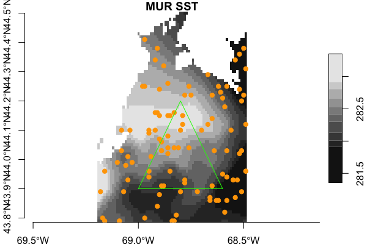
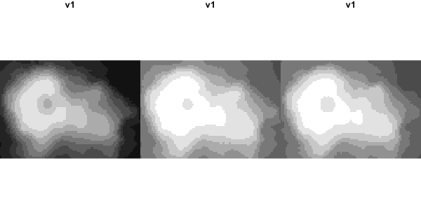
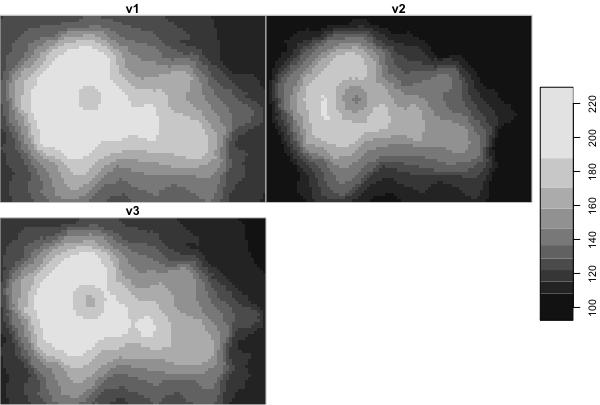

# twinkle

A small set of R tools to use with [sf](https://CRAN.R-project.org/package=sf) and [stars](https://CRAN.R-project.org/package=stars) in species distribution modeling.

## Requirements
 
 + [R v4+](https://www.r-project.org/)
 
 + [rlang](https://CRAN.R-project.org/package=rlang)
  
 + [dplyr](https://CRAN.R-project.org/package=dplyr)
 
 + [sf](https://CRAN.R-project.org/package=sf)
 
 + [stars](https://CRAN.R-project.org/package=stars)


## Resources

 + [RSeek.org](https://rseek.org/?q=stars+sf)
 
 + [rspatial.org](https://rspatial.org/)
 
 + [https://r-spatial.github.io](https://r-spatial.github.io/stars/)

## Intended usage

`stars` will handle a wide variety of data models, but this package is intended for use with regular grids with 3 dimensions such as [x, y, band], [x, y, time] or [x, y, z].  See about the  `stars` data model [here](https://r-spatial.github.io/stars/articles/stars4.html).  

## Provided example data

### MUR Sea Surface Temperature

One month of daily MUR SST rasters (as one GeoTIFF) from 2014 covering Penobscot Bay, Maine. The bounding box `[west, east, south, north]` is `[-69.2, -68.49, 43.78, 44.5]`. Dates provided are 2014-06-01 through 2014-06-30.  Also provided are daily sst slope and daily cumulative sst (origin January 1).  These are named `20140601-20140630-sst.tif`, `20140601-20140630-sst_slope.tif` amd `20140601-20140630-sst_cum.tif`.

```
sst <- stars::read_stars(system.file("datasets/20140601-20140630-sst.tif", 
                                     package = "twinkle")),
slope <- stars::read_stars(system.file("datasets/20140601-20140630-sst_slope.tif", 
                                       package = "twinkle")),
cum <- stars::read_stars(system.file("datasets/20140601-20140630-sst_cum.tif", 
                                     package = "twinkle"))
```
                                       
These data are derived from...
> JPL MUR MEaSUREs Project. 2015. GHRSST Level 4 MUR Global Foundation Sea Surface Temperature Analysis. Ver. 4.1. PO.DAAC, CA, USA. Dataset accessed [2021-02-08] at https://doi.org/10.5067/GHGMR-4FJ04

100 points within Penobscot Bay, selected at random, stored in [geopackage](https://www.geopackage.org/) format. Use `sf::read_sf(system.file("datasets/penbay-points.gpkg", package = 'twinkle'))` to read them in.

A polygons within Penobscot Bay stored in [geopackage](https://www.geopackage.org/) format.  Use `sf::read_sf(system.file("datasets/penbay-polygons.gpkg", package = 'twinkle'))` to them in.

```
library(sf)
library(stars)
library(dplyr)

sst <- stars::read_stars(system.file("datasets/20140601-20140630-sst.tif", package = "twinkle"))
# stars object with 3 dimensions and 1 attribute
# attribute(s):
#  20140601-20140630-sst.tif 
#  Min.   :281.4             
#  1st Qu.:283.7             
#  Median :284.5             
#  Mean   :284.4             
#  3rd Qu.:285.2             
#  Max.   :287.6             
#  NA's   :46050             
# dimension(s):
#      from to  offset delta refsys point values x/y
# x       1 71 -69.195  0.01 WGS 84 FALSE   NULL [x]
# y       1 72  44.505 -0.01 WGS 84 FALSE   NULL [y]
# band    1 30      NA    NA     NA    NA   NULL  

pts <- sf::read_sf(system.file("datasets/penbay-points.gpkg", package = 'twinkle'))
# Simple feature collection with 100 features and 6 fields
# geometry type:  POINT
# dimension:      XY
# bbox:           xmin: -69.18 ymin: 43.79 xmax: -68.49 ymax: 44.41
# geographic CRS: WGS 84
# # A tibble: 100 x 7
#     index  cell   col   row layer   sst           geom
#     <int> <dbl> <dbl> <dbl> <dbl> <dbl>    <POINT [°]>
#  1  95384  3368    31    48    19  284. (-68.89 44.03)
#  2  19875  4539    66    64     4  282. (-68.54 43.87)
#  3 136212  3300    34    47    27  285. (-68.86 44.04)
#  4 145992  2856    16    41    29  287.  (-69.04 44.1)
#  5 130243  2443    29    35    26  285. (-68.91 44.16)
#  6  78418  1738    34    25    16  284. (-68.86 44.26)
#  7  60452  4220    31    60    12  285. (-68.89 43.91)
#  8 104298  2058    70    29    21  285.  (-68.5 44.22)
#  9  55121  4001    25    57    11  285. (-68.95 43.94)
# 10  64280  2936    25    42    13  285. (-68.95 44.09)
# # … with 90 more rows


poly <- sf::read_sf(system.file("datasets/penbay-polygons.gpkg", package = 'twinkle'))
# Simple feature collection with 1 feature and 0 fields
# geometry type:  POLYGON
# dimension:      XY
# bbox:           xmin: -69 ymin: 43.9 xmax: -68.6 ymax: 44.2
# geographic CRS: WGS 84
# # A tibble: 1 x 1
#                                             geom
#                                    <POLYGON [°]>
# 1 ((-69 43.9, -68.6 43.9, -68.8 44.2, -69 43.9))


# plot just the first band
plot(sst[,,,1], axes = TRUE, main = "MUR SST", reset = F)
plot(sf::st_geometry(pts), add = TRUE, pch = 19, col = "orange")
plot(poly, add = TRUE, border = "green", col = NA)
```


### Volcano

A `stars` version of this [nice example](https://waterdata.usgs.gov/blog/inlmiscmaps/) of the built in `volcano` dataset. Points and polygons are also provided but not shown here.  See \code{volcano_points} and \code{volcano_polygon}.

First read in the volcano data with a single band, but three different attributes (variables). Note that each attribute is independently scaled.
```
v_a <- volcano_multi(what = "attributes")
# stars object with 2 dimensions and 3 attributes
# attribute(s):
#       v1               v2              v3        
#  Min.   : 90.28   Min.   :111.9   Min.   :108.0  
#  1st Qu.:103.72   1st Qu.:128.6   1st Qu.:124.0  
#  Median :119.09   Median :147.6   Median :142.4  
#  Mean   :125.03   Mean   :155.0   Mean   :149.5  
#  3rd Qu.:144.06   3rd Qu.:178.6   3rd Qu.:172.3  
#  Max.   :187.28   Max.   :232.2   Max.   :224.0  
# dimension(s):
#   from to  offset delta                       refsys point values x/y
# x    1 87 6478705    10 NZGD49 / New Zealand Map ...    NA   NULL [x]
# y    1 61 2668015   -10 NZGD49 / New Zealand Map ...    NA   NULL [y]

par(mfrow = c(1,3))
plot(v_a, attr = 1, reset = F, key.pos = NULL)
plot(v_a, attr = 2, reset = F, key.pos = NULL)
plot(v_a, attr = 3, reset = F, key.pos = NULL)
par(mfrow = c(1,1))
```


But we can reorganize so that instead of three different attributes with single bands that we have three bands for a single attribute.  Note the plot scales all bands into the same color scale.
```
v_b <- volcano_multi(what = "bands")
# stars object with 3 dimensions and 1 attribute
# attribute(s):
#        X         
#  Min.   : 92.43  
#  1st Qu.:118.63  
#  Median :136.69  
#  Mean   :142.79  
#  3rd Qu.:164.81  
#  Max.   :229.56  
# dimension(s):
#         from to  offset delta                       refsys point     values x/y
# x          1 87 6478705    10 NZGD49 / New Zealand Map ...    NA       NULL [x]
# y          1 61 2668015   -10 NZGD49 / New Zealand Map ...    NA       NULL [y]
# volcano    1  3      NA    NA                           NA    NA v1, v2, v3    

plot(v_b)
```



### Tiny Toy

A multiband dataset with very small dimensions, with convenient polygons and points.

```
x <- toy()
# stars object with 3 dimensions and 1 attribute
# attribute(s):
#        X        
#  Min.   :  1.0  
#  1st Qu.:115.5  
#  Median :234.0  
#  Mean   :237.0  
#  3rd Qu.:356.5  
#  Max.   :500.0  
#  NA's   :225    
# dimension(s):
#      from to offset delta refsys point    values x/y
# x       1 10      0     1     NA    NA      NULL [x]
# y       1 10     10    -1     NA    NA      NULL [y]
# band    1  5     NA    NA     NA    NA b1,...,b5 


pts <- toy_points()
# Simple feature collection with 10 features and 2 fields
# geometry type:  POINT
# dimension:      XY
# bbox:           xmin: 0.07982157 ymin: 0.2764683 xmax: 8.318394 ymax: 8.685324
# CRS:            NA
# # A tibble: 10 x 3
#       id band                geometry
#    <int> <chr>                <POINT>
#  1     1 b2       (4.893872 1.545638)
#  2     2 b1      (5.523114 0.2878492)
#  3     3 b3    (0.07982157 0.2764683)
#  4     4 b1       (2.738887 8.685324)
#  5     5 b1       (5.594837 7.240075)
#  6     6 b4       (7.357766 7.182376)
#  7     7 b1       (1.107721 8.132763)
#  8     8 b5        (1.55757 7.238407)
#  9     9 b2       (8.318394 5.955514)
# 10    10 b3       (3.623221 1.627933)

poly <- toy_polygon()
# Simple feature collection with 1 feature and 1 field
# geometry type:  POLYGON
# dimension:      XY
# bbox:           xmin: 3 ymin: 2 xmax: 8 ymax: 8
# CRS:            NA
#   id                           geom
# 1  1 POLYGON ((5 8, 8 5, 5 2, 3 ...


plot(x[,,,1], axes = TRUE, reset = FALSE)
plot(sf::st_geometry(pts), add = TRUE, pch = 19, col = "orange")
plot(poly, add = TRUE, border = "green", col = NA)
```


## Wiki

The [wiki](https://github.com/BigelowLab/twinkle/wiki) provides a suite of examples.


