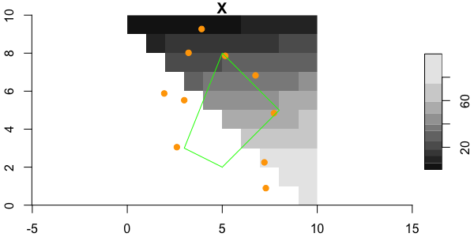

# twinkle

A small set of R tools to use with [sf](https://CRAN.R-project.org/package=sf) and [stars](https://CRAN.R-project.org/package=stars) in species distribution modeling.

## Requirements
 
 + [R v4+](https://www.r-project.org/)
 
 + [rlang](https://CRAN.R-project.org/package=rlang)
  
 + [dplyr](https://CRAN.R-project.org/package=dplyr)
 
 + [sf](https://CRAN.R-project.org/package=sf)
 
 + [stars](https://CRAN.R-project.org/package=stars)


## Resources

 + [RSeek.org](https://rseek.org/?q=stars+sf)
 
 + [rspatial.org](https://rspatial.org/)
 
 + [https://r-spatial.github.io](https://r-spatial.github.io/stars/)


## Provided example data

### MUR Sea Surface Temperature

One month of daily MUR SST rasters (as one GeoTIFF) from 2014 covering Penobscot Bay, Maine. The bounding box `[west, east, south, north]` is `[-69.2, -68.49, 43.78, 44.5]`. Dates provided are 2014-06-01 through 2014-06-30.  Also provided are daily sst slope and daily cumulative sst (origin January 1).  These are named `20140601-20140630-sst.tif`, `20140601-20140630-sst_slope.tif` amd `20140601-20140630-sst_cum.tif`.

> JPL MUR MEaSUREs Project. 2015. GHRSST Level 4 MUR Global Foundation Sea Surface Temperature Analysis. Ver. 4.1. PO.DAAC, CA, USA. Dataset accessed [2021-02-08] at https://doi.org/10.5067/GHGMR-4FJ04

100 points within Penobscot Bay, selected at random, stored in [geopackage](https://www.geopackage.org/) format. Use `sf::read_sf(system.file("datasets/penbay-points.gpkg", package = 'twinkle))` to read them in.

A polygons within Penobscot Bay stored in [geopackage](https://www.geopackage.org/) format.  Use `sf::read_sf(system.file("datasets/penbay-polygons.gpkg", package = 'twinkle))` to them in.

```
library(sf)
library(stars)
library(dplyr)

sst <- stars::read_stars(system.file("datasets/20140601-20140630-sst.tif", package = "twinkle"))
pts <- sf::read_sf(system.file("datasets/penbay-points.gpkg", package = 'twinkle'))
poly <- sf::read_sf(system.file("datasets/penbay-polygons.gpkg", package = 'twinkle'))

plot(sst[,,,1], axes = TRUE, main = "MUR SST", reset = F)
plot(sf::st_geometry(pts), add = TRUE, pch = 19, col = "orange")
plot(poly, add = TRUE, border = "green", col = NA)
```


### Volcano

A `stars` version of this [nice example](https://waterdata.usgs.gov/blog/inlmiscmaps/) of the built in `volcano` dataset. Points and polygons are also provided but not shown here.  See \code{volcano_points} and \code{volcano_polygon}.

First read in the volcano data with a single band, but three different attributes (variables). Note that each attribute is independently scaled.
```
v_a <- volcano_multi(what = "attributes")
# stars object with 2 dimensions and 3 attributes
# attribute(s):
#       v1               v2              v3        
#  Min.   : 90.28   Min.   :111.9   Min.   :108.0  
#  1st Qu.:103.72   1st Qu.:128.6   1st Qu.:124.0  
#  Median :119.09   Median :147.6   Median :142.4  
#  Mean   :125.03   Mean   :155.0   Mean   :149.5  
#  3rd Qu.:144.06   3rd Qu.:178.6   3rd Qu.:172.3  
#  Max.   :187.28   Max.   :232.2   Max.   :224.0  
# dimension(s):
#   from to  offset delta                       refsys point values x/y
# x    1 87 6478705    10 NZGD49 / New Zealand Map ...    NA   NULL [x]
# y    1 61 2668015   -10 NZGD49 / New Zealand Map ...    NA   NULL [y]

par(mfrow = c(1,3))
plot(v_a, attr = 1, reset = F, key.pos = NULL)
plot(v_a, attr = 2, reset = F, key.pos = NULL)
plot(v_a, attr = 3, reset = F, key.pos = NULL)
par(mfrow = c(1,1))
```


But we can reorganize and assume that instead of three different attributes that we have three bands for a single attribute.  Note the plot scales all bands into the same color scale.
```
v_b <- volcano_multi(what = "bands")
# stars object with 3 dimensions and 1 attribute
# attribute(s):
#        X         
#  Min.   : 92.43  
#  1st Qu.:118.63  
#  Median :136.69  
#  Mean   :142.79  
#  3rd Qu.:164.81  
#  Max.   :229.56  
# dimension(s):
#         from to  offset delta                       refsys point     values x/y
# x          1 87 6478705    10 NZGD49 / New Zealand Map ...    NA       NULL [x]
# y          1 61 2668015   -10 NZGD49 / New Zealand Map ...    NA       NULL [y]
# volcano    1  3      NA    NA                           NA    NA v1, v2, v3    

plot(v_b)
```


### Tiny Toy

Multiband or multi-attribute dataset - with very small dimensions, with convenient polygons and points.

```
x <- toy() 
pts <- toy_points()
poly <- toy_polygon()

plot(x[,,,1], axes = TRUE, reset = FALSE)
plot(pts["id"], add = TRUE, pch = 19, col = "orange")
plot(poly, add = TRUE, border = "green", col = NA)
```


## Wiki

The [wiki](https://github.com/BigelowLab/twinkle/wiki) provides a suite of examples.


